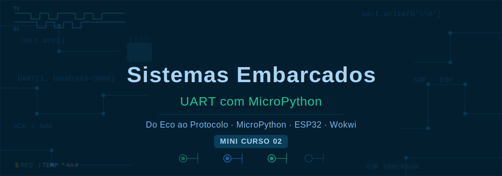

# UART com MicroPython — Do Eco ao Protocolo



> **Mini Curso 02** — Estudo dirigido para alunos do Curso Técnico em Automação Industrial.  
> *Continuação de: Mini Curso 01 — Lógica Digital com ESP32*

---

## Sobre o curso

Este material é um **mini-curso de apoio ao estudo da comunicação serial baseada em UART**. Ele não pressupõe experiência prévia com protocolos de comunicação — apenas familiaridade com Python básico e, de preferência, com o Mini Curso 01.

O objetivo é conduzir o aluno desde o conceito mais simples possível — um byte que vai e volta — até a construção de um **mini-protocolo bidirecional completo**, com frame estruturado, verificação de integridade e retransmissão automática. Ao final, o aluno reconhecerá, nos protocolos industriais reais como Modbus e CANbus, os mesmos elementos que construiu com as próprias mãos.

---

## Linha de raciocínio do curso

A construção foi pensada para que **cada passo introduza exatamente um conceito novo**, sempre partindo do que já foi aprendido. Não há saltos — cada ideia é o alicerce da próxima.

O percurso segue quatro fases naturais:

**Fase 1 — Comunicação básica com o terminal**
O aluno começa com o mais simples: um byte enviado pelo terminal volta para o terminal. A partir daí, esse byte começa a ter significado — controla um LED, consulta um dicionário. O foco é entender o ciclo *receber → decidir → responder*.

**Fase 2 — Estrutura e robustez**
Bytes soltos dão lugar a mensagens estruturadas. O aluno aprende a acumular bytes em um buffer até receber um terminador, a organizar o comportamento do sistema em estados explícitos (máquina de estados), e a proteger o sistema contra mensagens incompletas com timeout e limite de buffer. Esses três mecanismos juntos formam a espinha dorsal de qualquer receptor serial profissional.

**Fase 3 — Comunicação entre periféricos**
A comunicação sai do terminal e passa a acontecer entre duas UARTs do mesmo ESP32, conectadas por fios reais. O aluno atribui papéis distintos às UARTs — controladora e periférica — e implementa o modelo de requisição e resposta usado pelo Modbus. Adiciona então um checksum XOR para detectar corrupção de dados em trânsito.

**Fase 4 — Protocolo completo**
Tudo se une em um mini-protocolo com frame estruturado (`$TIPO:PAYLOAD*XX#`), confirmação (ACK/NAK) e retransmissão automática. O código do protocolo é extraído para um módulo compartilhado — exatamente como se faz em projetos reais.

---

## Plataforma

| Item | Especificação |
|------|---------------|
| Microcontrolador | ESP32 DevKit C v4 (principal) |
| Compatibilidade | Raspberry Pi Pico (instruções nos comentários do código) |
| Linguagem | MicroPython |
| IDE (placa real) | [Thonny](https://thonny.org) |
| Simulador | [Wokwi](https://wokwi.com) — nenhuma instalação necessária |

> **Nota sobre simulação:** os passos 1 a 6 incluem dois arquivos de código — `main_wokwi.py` para o simulador e `main_placa.py` para uso com hardware real. A razão está explicada em cada passo: o `$serialMonitor` do Wokwi entrega bytes com latência, exigindo leitura bloqueante no simulador; na placa real, o padrão não bloqueante com `uart.any()` é o correto.

---

## Site do curso

**[https://rogerioMB-hub.github.io/minicurso_02-embarcados](https://rogerioMB-hub.github.io/minicurso_02-embarcados)**

---

## Sequência de passos

### Fase 1 — PC ↔ Placa via Serial Monitor

| # | Título | Conceito introduzido | Entregável |
|---|--------|----------------------|------------|
| [1](./aulas/passo01-eco-serial.md) | Eco Serial | `uart.read()`, `uart.write()` | Bytes ecoados de volta ao terminal |
| [2](./aulas/passo02-led-uart.md) | Controle de LED | Decisão por char, `if/elif/else` | LED ligado/desligado por comando serial |
| [3](./aulas/passo03-dicionario.md) | Dicionário de comandos | `dict`, operador `in`, despacho por chave | Respostas por extenso via lookup table |

### Fase 2 — Estrutura e robustez

| # | Título | Conceito introduzido | Entregável |
|---|--------|----------------------|------------|
| [4](./aulas/passo04-parsing.md) | Parsing com terminador | Buffer, `'\n'`, `split()` | Comandos com argumento: `LED:L`, `MSG:texto` |
| [5](./aulas/passo05-maquina-estados.md) | Máquina de estados | FSM — IDLE / RECEBENDO / PROCESSANDO | Recepção robusta com estados explícitos |
| [6](./aulas/passo06-buffer-timeout.md) | Buffer e timeout | `ticks_ms()`, limite de buffer | Auto-recuperação sem reset manual |

### Fase 3 — Placa ↔ Placa (loopback)

| # | Título | Conceito introduzido | Entregável |
|---|--------|----------------------|------------|
| [7](./aulas/passo07-loopback.md) | Loopback físico | UART1 ↔ UART2, fios cruzados | Comunicação real entre duas UARTs |
| [8](./aulas/passo08-controladora-periferica.md) | Controladora–Periférica | Papéis assimétricos, leitura de sensor | Protocolo `REQ:SENSOR` / `DADO:SENSOR:VALOR` |
| [9](./aulas/passo09-checksum.md) | Checksum XOR | Integridade de dados, detecção de erros | Frame `PAYLOAD*XX` com verificação |

### Fase 4 — Protocolo completo

| # | Título | Conceito introduzido | Entregável |
|---|--------|----------------------|------------|
| [10](./aulas/passo10-protocolo.md) | Mini-protocolo completo | SOF/EOF, ACK/NAK, retransmissão, módulo compartilhado | Frame `$TIPO:PAYLOAD*XX#` com retransmissão automática |

---

## Como usar

1. Acesse o **[site do curso](https://rogerioMB-hub.github.io/minicurso_02-embarcados)** e leia o conteúdo de cada passo.
2. Abra [wokwi.com/projects/new/micropython-esp32](https://wokwi.com/projects/new/micropython-esp32) para simular.
3. Copie os arquivos da pasta `wokwi/` de cada passo para as abas do simulador (`diagram.json` e `main_wokwi.py`).
4. Execute, observe o Serial Monitor e responda as perguntas da seção **Experimento**.
5. Tente o **Desafio** antes de passar para o próximo passo.
6. Com hardware em mãos, use `main_placa.py` no Thonny.

---

## Estrutura do repositório

```
minicurso_02-embarcados/
├── README.md
├── index.md                        ← página inicial do site
├── _config.yml                     ← configuração Jekyll / GitHub Pages
├── COMO-PUBLICAR.md
├── assets/
│   └── banner.svg
└── aulas/
    ├── passo01-eco-serial.md
    ├── passo01-eco-serial/
    │   └── wokwi/
    │       ├── diagram.json        ← circuito do simulador
    │       ├── wokwi.toml
    │       ├── main_wokwi.py       ← código para o Wokwi
    │       └── main_placa.py       ← código para ESP32 / Pico real
    │   (estrutura idêntica para passos 02 a 06)
    ├── passo07-loopback/
    │   └── wokwi/
    │       ├── diagram.json
    │       ├── wokwi.toml
    │       └── main.py             ← código único (sem conflito de simulação)
    │   (idem para passos 08 e 09)
    └── passo10-protocolo/
        └── wokwi/
            ├── diagram.json
            ├── wokwi.toml
            ├── main.py
            └── protocolo.py        ← módulo compartilhado do protocolo
```

---

## Pré-requisitos

| Item | Detalhe |
|------|---------|
| Programação | Python básico: variáveis, `if/else`, `while`, funções |
| Recomendado | Mini Curso 01 — Lógica Digital com ESP32 |
| Simulador | Saber criar um projeto no Wokwi com ESP32 e MicroPython |

---

## Conexão com protocolos industriais reais

Ao concluir o Mini Curso 02, o aluno reconhecerá os seguintes elementos em protocolos como Modbus RTU, CANbus e HDLC:

| Conceito do curso | Equivalente industrial |
|-------------------|----------------------|
| Buffer + terminador `'\n'` | Delimitador de frame (Modbus: silêncio de 3,5 bits) |
| Máquina de estados | Base de toda implementação de protocolo |
| Timeout + limite de buffer | Recuperação de erros em TCP, Modbus |
| Controladora–Periférica | Mestre–Escravo Modbus RTU |
| Checksum XOR | CRC-16 do Modbus, CRC-32 do Ethernet |
| SOF / EOF | Flags de início/fim de frame do HDLC e PPP |
| ACK / NAK + retransmissão | Confirmação no XMODEM, TCP, Modbus |

---

## Licença

MIT — livre para uso educacional e comercial com atribuição.
