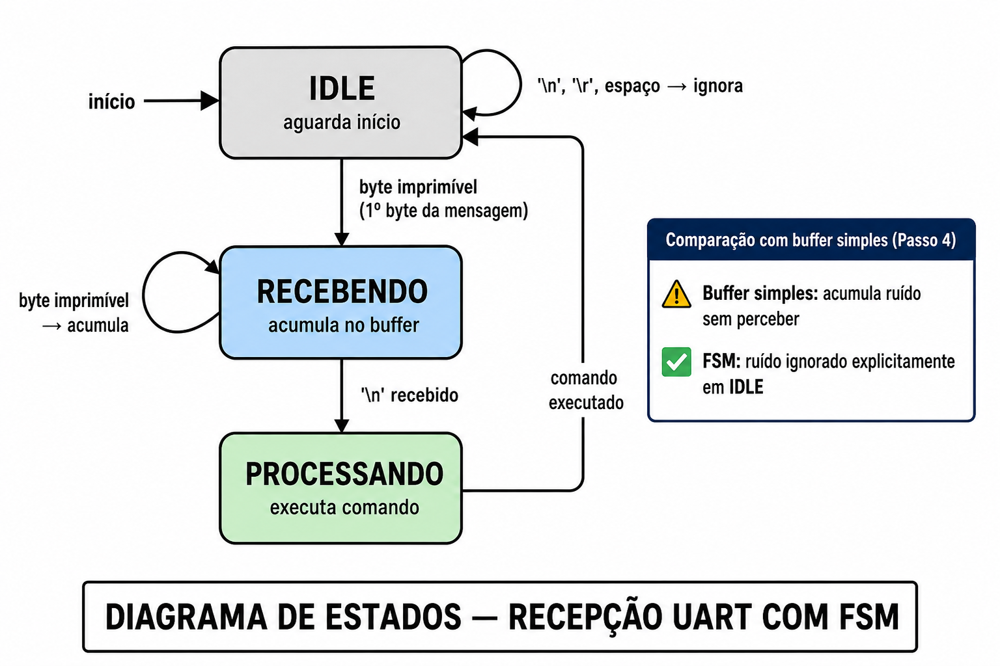

# Passo 5 — Máquina de Estados para Recepção UART

> **Duração estimada:** 30 minutos
> **Fase:** 2 de 4 — Estrutura e robustez

---

## Simulação e Código

> **O código completo está disponível nos arquivos abaixo.** Copie cada um para a aba correspondente no Wokwi antes de iniciar o experimento.

| Arquivo | Descrição | Link |
|---------|-----------|------|
| `diagram.json` | Circuito no simulador | [abrir](https://github.com/rogerioMB-hub/minicurso_02-embarcados/blob/main/aulas/passo05-maquina-estados/wokwi/diagram.json) |
| `wokwi.toml` | Configuração do projeto | [abrir](https://github.com/rogerioMB-hub/minicurso_02-embarcados/blob/main/aulas/passo05-maquina-estados/wokwi/wokwi.toml) |
| `main_wokwi.py` | Código para o Wokwi | [abrir](https://github.com/rogerioMB-hub/minicurso_02-embarcados/blob/main/aulas/passo05-maquina-estados/wokwi/main_wokwi.py) |
| `main_placa.py` | Código para ESP32 real (Thonny) | [abrir](https://github.com/rogerioMB-hub/minicurso_02-embarcados/blob/main/aulas/passo05-maquina-estados/wokwi/main_placa.py) |

### ⚠️ Por que dois arquivos de código?

| | `main_wokwi.py` | `main_placa.py` |
|---|---|---|
| **Leitura do terminal** | `input()` + `for char in linha` (simula bytes chegando um a um) | `if uart.any(): uart.read(1)` |
| **Comportamento** | Itera sobre a string para acionar as transições da FSM | Byte a byte em tempo real |
| **Uso** | Wokwi (simulação) | ESP32 com Thonny |

> **Por que `uart.any()` não funciona no Wokwi?**
> O `$serialMonitor` entrega bytes com latência — `uart.any()` retorna `0` antes do byte chegar.
> No Wokwi usamos `input()` e iteramos sobre cada caractere com `for char in linha` para preservar o comportamento da FSM.
> Na placa real com Thonny, `uart.any()` funciona e os bytes alimentam a FSM em tempo real.

---

## Objetivos

Ao final deste passo você será capaz de:

- Implementar uma Máquina de Estados Finitos (FSM) para recepção serial
- Tornar o comportamento do sistema explícito e previsível
- Entender por que FSMs são o padrão em implementações de protocolo profissional

---

## 1. Conceito

### O problema do passo 4

No passo 4, o buffer acumulava bytes assim que chegavam — sem verificar se eram bytes úteis ou ruído. Imagine que o terminal envie um `'\r'` sozinho, ou que a linha tenha ruído elétrico e chegue um byte aleatório antes da mensagem. O sistema tentaria processar uma mensagem malformada sem perceber.

O passo 4 funciona bem em condições ideais. Mas em sistemas reais — cabos longos, interferência, conexão instável — o comportamento imprevisível é um problema sério.

---

### A solução: Máquina de Estados Finitos (FSM)

Uma **Máquina de Estados Finitos** (do inglês *Finite State Machine* — FSM) é um modelo de comportamento onde o sistema:

- Está sempre em **um único estado por vez**
- Só muda de estado quando uma **condição específica** é satisfeita
- Sabe **exatamente o que fazer** em cada estado e **o que ignorar**

Você já trabalhou com esse conceito no Mini Curso 01, Aula 5. Aqui aplicamos a mesma ideia à recepção serial.

---

### Os três estados da recepção

O receptor UART deste passo tem três estados bem definidos:

| Estado | O sistema está... | Aceita | Ignora |
|--------|-------------------|--------|--------|
| `IDLE` | Aguardando início de mensagem | Qualquer byte imprimível | `'\n'`, `'\r'`, espaços |
| `RECEBENDO` | Acumulando bytes no buffer | Bytes imprimíveis e `'\n'` | `'\r'` |
| `PROCESSANDO` | Executando o comando | — | — (transição imediata) |

---

### O diagrama de estados

O diagrama abaixo mostra os três estados (círculos) e as condições de cada transição (setas):

```
                    byte imprimível
               ┌────────────────────────────────────────────┐
               │                                            │
    início     ▼         byte imprimível                    │
      ──►  ( IDLE ) ─────────────────────► ( RECEBENDO ) ───┘
              │  ▲                               │
   '\n''\r''  │  │                               │ '\n' recebido
   ' ' (ruído)│  │  processamento concluído      │
              │  │  (volta ao IDLE)              ▼
              │  └──────────────── ( PROCESSANDO )
              │                          │
              └──────────────────────────┘
                   '\n''\r'' ' ' (ruído ignorado)
```

> **Lendo o diagrama:**
> - Em `IDLE`, bytes de ruído (`'\r'`, `'\n'`, espaços) são descartados — o sistema fica parado, sem acumular lixo no buffer
> - O **primeiro byte imprimível** dispara a transição para `RECEBENDO` e inicia o buffer com esse byte
> - Em `RECEBENDO`, cada byte imprimível é acumulado; ao chegar `'\n'`, vai para `PROCESSANDO`
> - `PROCESSANDO` executa o comando e retorna imediatamente ao `IDLE`


---

### Comparando passo 4 e passo 5

| Situação | Passo 4 | Passo 5 (FSM) |
|----------|---------|---------------|
| Recebe `'\r'` antes da mensagem | Acumula no buffer | Ignora em IDLE |
| Recebe byte de ruído no início | Acumula no buffer | Ignora em IDLE |
| Recebe `'\n'` vazio | Processa string vazia | Ignora em IDLE |
| Mensagem válida `LED:L\n` | Funciona | Funciona |
| Comportamento com ruído | Imprevisível | Previsível e controlado |

---

### Por que isso importa em sistemas embarcados?

Em automação industrial, protocolos seriais precisam ser robustos. Um CLP (Controlador Lógico Programável) não pode "travar" ou executar comandos errados por causa de ruído na linha. A FSM garante que o sistema só processe o que for válido — e ignore tudo o mais de forma explícita e documentada.

---

## 2. Circuito

Mesmo do passo 4 — ESP32 com Serial Monitor e LED no GPIO2.

Link wokwi: < https://wokwi.com/projects/463769688852953089 >

---

## 3. Código

> O código completo está nos arquivos linkados acima (`main_wokwi.py` e `main_placa.py`).
> Abaixo estão os trechos essenciais para leitura e compreensão.

Estrutura das funções de transição:

```python
IDLE        = 'IDLE'
RECEBENDO   = 'RECEBENDO'
PROCESSANDO = 'PROCESSANDO'

def no_idle(char):
    """IDLE: ignora ruído; qualquer byte útil inicia recepção."""
    if char in ('\n', '\r', ' '):
        return IDLE           # permanece IDLE
    else:
        return RECEBENDO      # inicia recepção com este byte

def no_recebendo(char, buf):
    """RECEBENDO: acumula até '\n'."""
    if char == '\n':
        return PROCESSANDO, buf
    elif char == '\r':
        return RECEBENDO, buf          # ignora '\r' (Windows)
    else:
        return RECEBENDO, buf + char   # acumula
```

Loop principal com transições explícitas (versão placa real):

```python
while True:
    if uart.any():
        byte = uart.read(1)
        char = byte.decode()

        if estado == IDLE:
            proximo = no_idle(char)
            if proximo == RECEBENDO:
                buffer = char         # guarda o primeiro byte
            estado = proximo
            print(f"[{estado}]", end=' ')

        elif estado == RECEBENDO:
            proximo, buffer = no_recebendo(char, buffer)
            estado = proximo
            print(f"[{estado}]", end=' ')

        if estado == PROCESSANDO:
            resposta = processar(buffer)
            uart.write(resposta + '\n')
            print(f"\n>> {resposta}")
            buffer = ''
            estado = IDLE
```

---

## 4. Experimento

Execute o código e observe as transições de estado no terminal.

**a)** Envie `LED:L`. Quais estados aparecem na sequência?

> _______________________________________________

**b)** Envie apenas `\n` (uma linha vazia). O que acontece em IDLE? E em RECEBENDO?

> _______________________________________________

**c)** Compare com o passo 4: qual a diferença de comportamento ao receber um `'\r'` no início, antes de qualquer mensagem?

> _______________________________________________

**d)** Por que usar constantes nomeadas (`IDLE = 'IDLE'`) em vez de números (`0`, `1`, `2`)?

> _______________________________________________

---

## 5. Desafio

**Desafio:** adicione um quarto estado `ERRO` que o sistema entra quando recebe um caractere inválido. No estado `ERRO`, o sistema descarta tudo até receber `'\n'`, depois volta ao IDLE:

```python
ERRO = 'ERRO'

# Em no_recebendo, adicione:
elif ord(char) < 32 and char not in ('\n', '\r'):
    return ERRO, ''   # byte de controle inesperado → vai para ERRO

# Adicione o tratamento do estado ERRO no loop:
elif estado == ERRO:
    if char == '\n':
        uart.write("Mensagem descartada — caractere inválido\n")
        estado = IDLE
```

> **Para pensar:** a capacidade de **se recuperar** de erros sem precisar de reset manual é uma das qualidades mais valorizadas em sistemas embarcados industriais.

---

## Resumo

- A FSM torna o comportamento explícito: cada estado define claramente o que aceita e o que ignora
- `IDLE` filtra ruído de linha antes de iniciar o buffer — o passo 4 não fazia isso
- As funções de transição (`no_idle`, `no_recebendo`) são testáveis independentemente do hardware
- Protocolos profissionais (Modbus, HDLC) implementam FSMs mais complexas, mas com o mesmo princípio

---

*← [Passo 4](./passo04-parsing.md) | Próximo → [Passo 6: Buffer e Timeout](./passo06-buffer-timeout.md)*
